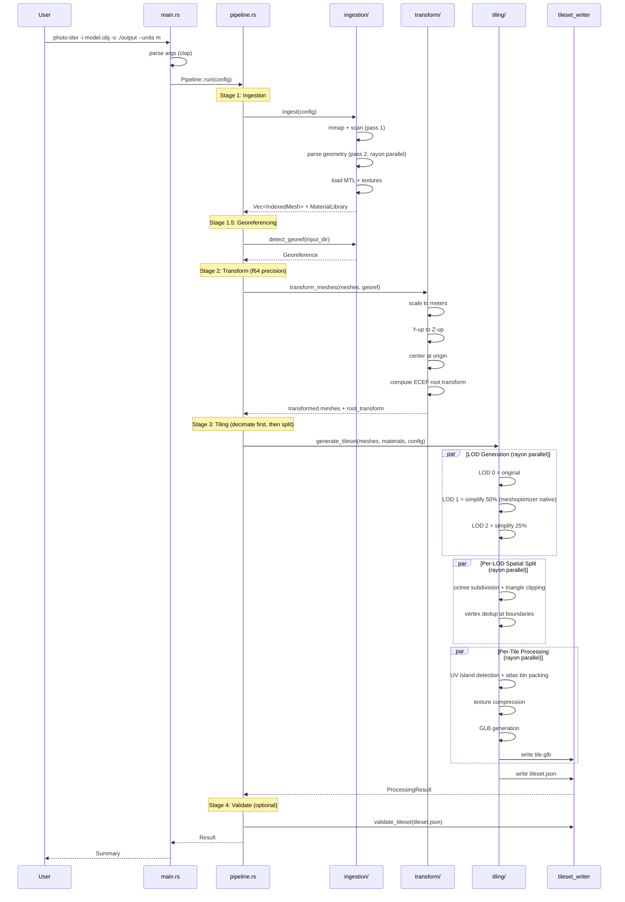
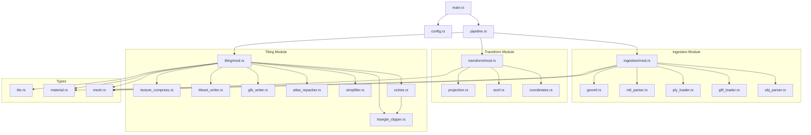
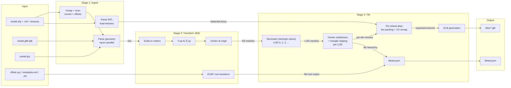
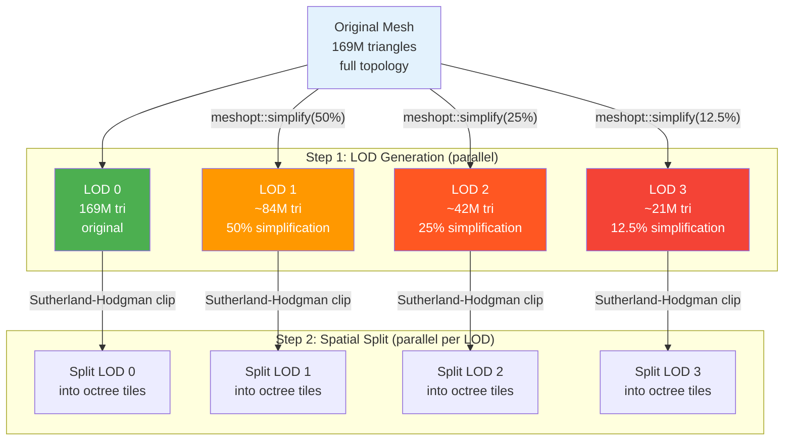
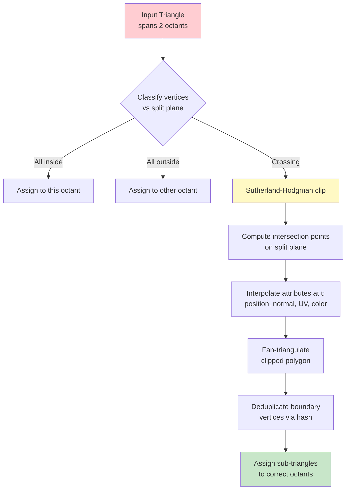
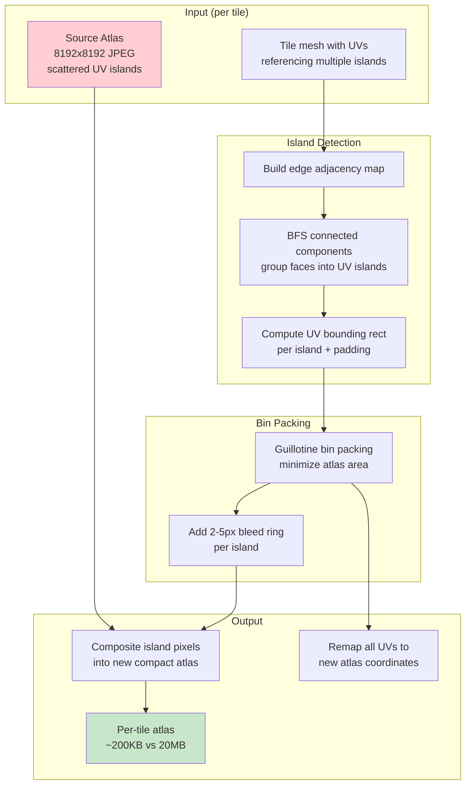
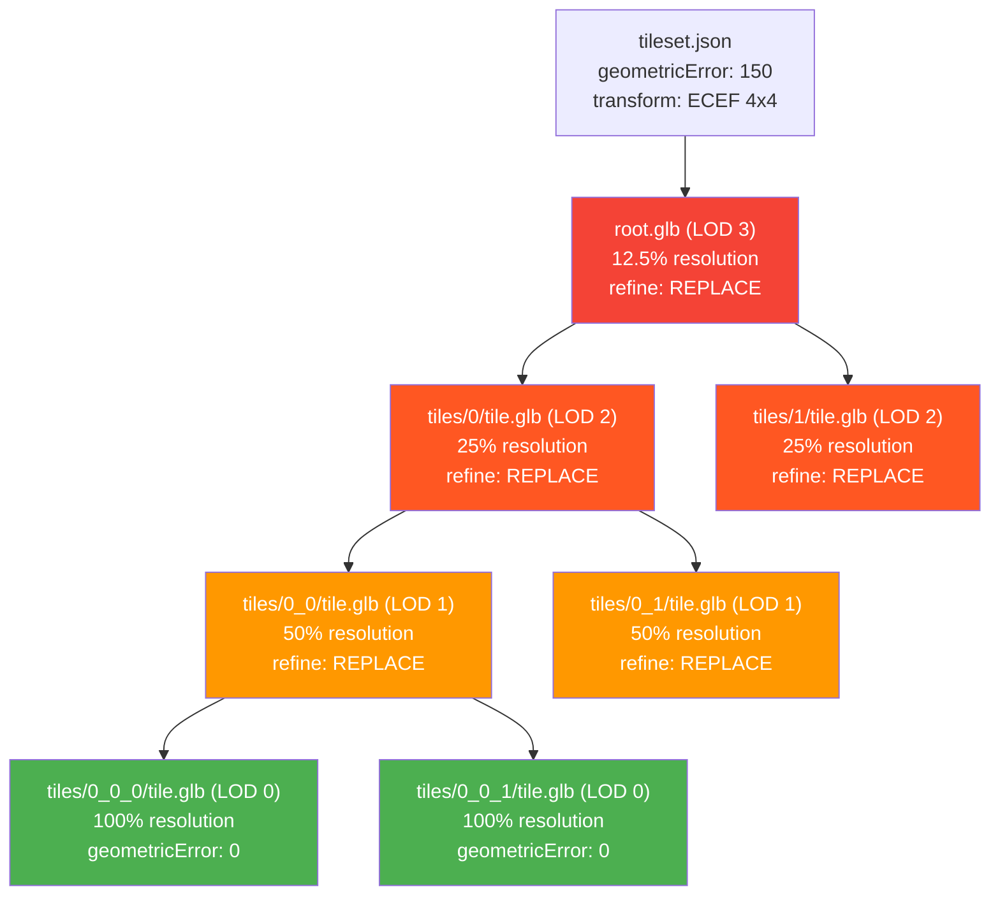
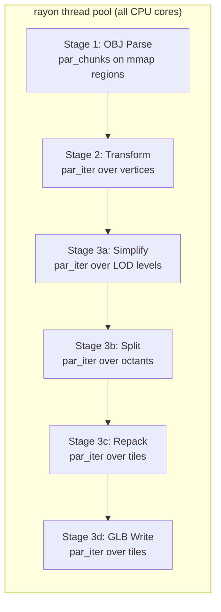

# Photo-Tiler UML Workflow Diagrams

All diagrams use Mermaid syntax and can be rendered in GitHub, VS Code, or any Mermaid-compatible viewer.

---

## 1. Pipeline Sequence Diagram

---

## 2. Module Dependency Graph

---

## 3. Data Flow Diagram

---

## 4. Decimate-First Pipeline (Key Architectural Decision)

**Why decimate first?** The simplifier sees the full watertight mesh and can make globally optimal edge-collapse decisions. Splitting after simplification preserves boundary continuity.

---

## 5. Triangle Clipping at Tile Boundaries

**No centroid fallback.** Every triangle crossing a boundary is clipped precisely, regardless of mesh size. This prevents gaps.

---

## 6. Per-Island Texture Atlas Repacking

---

## 7. 3D Tiles Output Structure

**Viewer behavior:** Load coarsest LOD first, progressively replace with higher-res children as camera approaches, unload when camera moves away.

---

## 8. Parallelism Model

All stages use rayon's work-stealing scheduler. No manual thread management. CPU utilization: ~90% on all cores.
